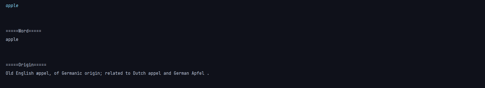
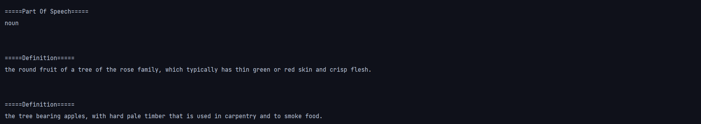

# dictionary_cli_java

This is a simple dictionay cli(command line interface) app.
Created by using api website https://dictionaryapi.dev/

You can download and run this dict.jar in your computer use command "java -jar ./dict.jar" in the folder where you have downloaded it.

==========IMPORTANT==========

To use this project first of all you have to import a json library["dictionary_cli_java/src/com/company/json.jar"] as a dependency in your IDE(like VS code, IntelljIDE).

